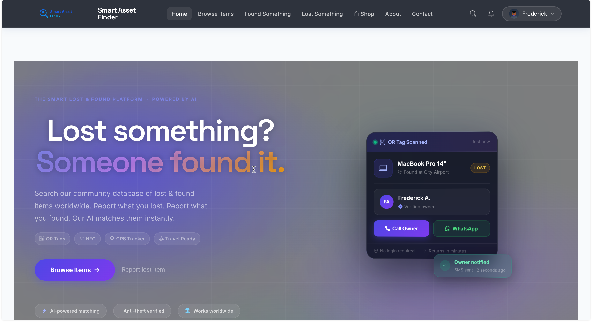
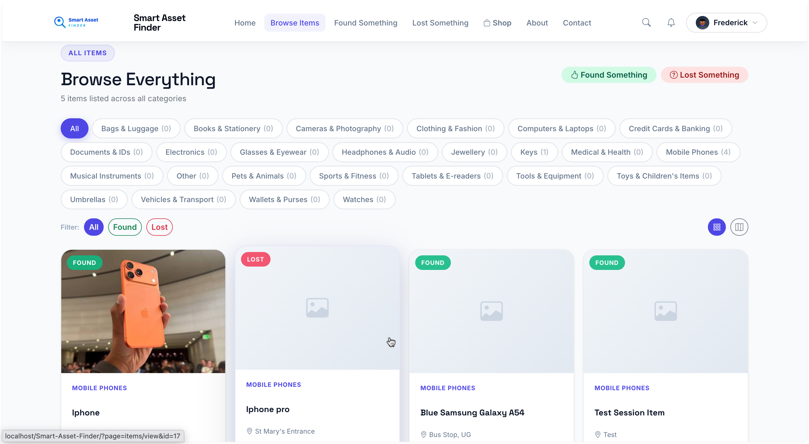
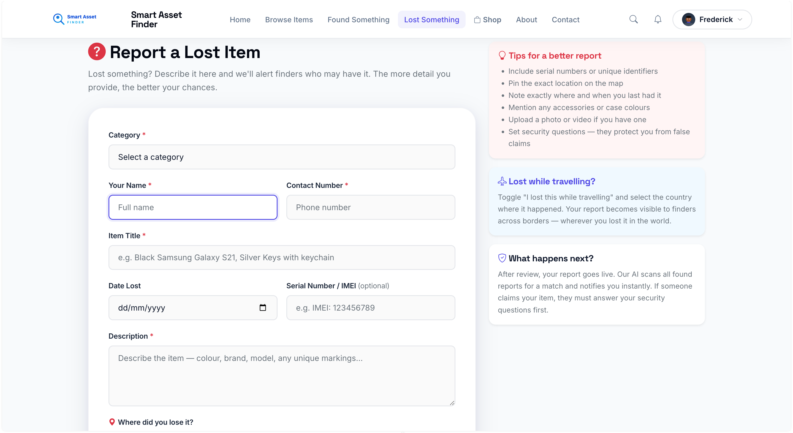
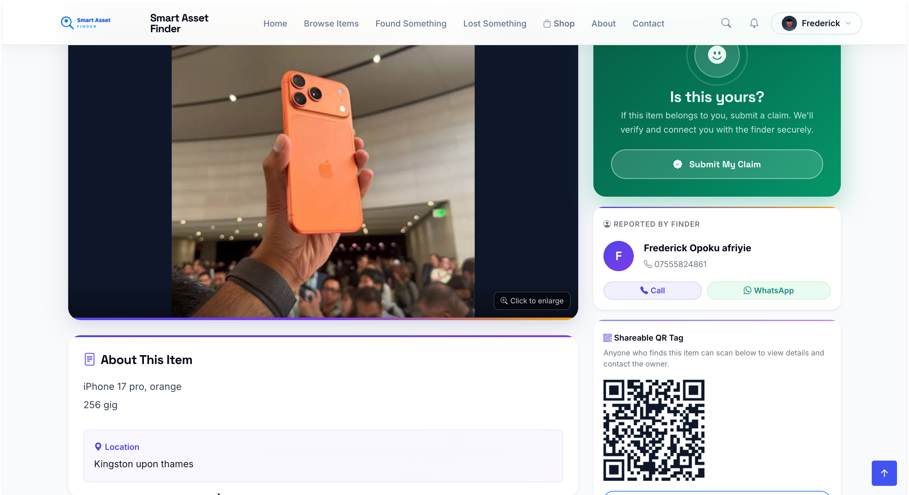
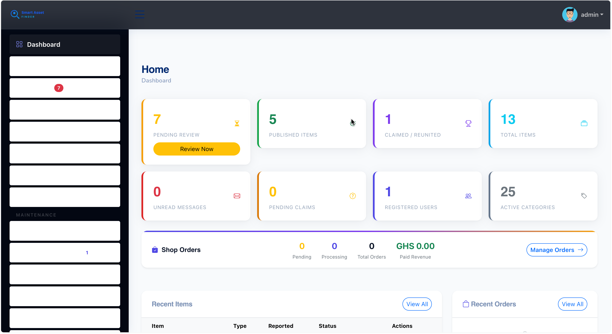
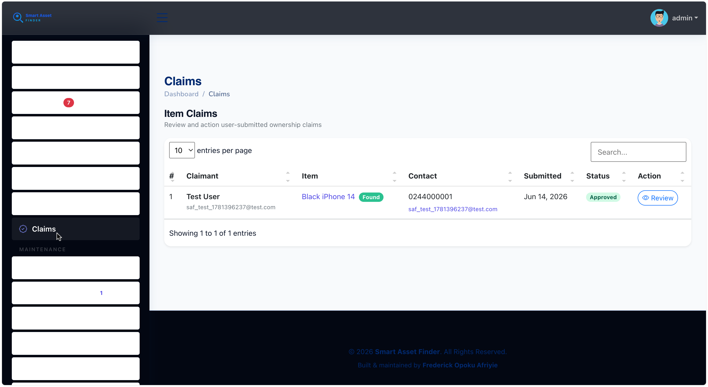

# Smart Asset Finder

A full-stack **Lost & Found platform** with AI-powered item matching, QR tagging, WhatsApp push notifications, GPS location tracking, and an admin broadcast system.

> Built by **Frederick Opoku Afriyie**

---

## Screenshots

| Homepage | Items (Map View) |
|---|---|
|  |  |

| Report Lost Item | Item Detail |
|---|---|
|  |  |

| Admin Dashboard | Admin Claims (AI Score) |
|---|---|
|  |  |

---

## Features

### Public Portal
- User registration with email verification and rate-limit protection
- Secure login with CSRF protection and session regeneration
- **Report a lost item** — map location picker (Leaflet.js + Nominatim geocoding), travel mode, security Q&A for proof of ownership
- **Report a found item** — map location picker, photo upload (up to 5 files, drag & drop), GPS capture
- **AI auto-matching** — when a found item is reported, Claude Haiku compares it against open lost reports in the same category; matching owners are notified instantly via in-app, email, and WhatsApp
- Browse and filter all items by category (25 categories), type (lost/found), and keyword search
- **Grid view and interactive map view** — items plotted as pins on a Leaflet map with full-screen toggle
- **Submit a claim** — security Q&A answers scored by AI (0–100%); proof image/PDF upload
- **QR tag per item** — printable tag that links to a smart landing page; no app needed for the finder
- **QR scan logging** — GPS coordinates, timestamp, and finder contact recorded on every scan; item owner notified via email + WhatsApp
- In-app notification bell — unread count badge and dropdown
- My Items — track all personal submissions
- My Claims — track submitted claims with status
- Profile management
- Password reset via email
- Shop — browse SAF hardware (GPS trackers, BLE tags)

### Admin Panel (`/admin`)
- Dashboard with live activity feed
- Review, approve, reject, and delete item reports
- **Manage claims** — view AI ownership score (colour-coded 0–100%), verification status badge, proof image/PDF preview; approve or reject with notes
- **Broadcast** — compose and send email + WhatsApp messages to all verified users; live recipient count; personalisation with `{{first}}` / `{{name}}`
- Registered user management — view, ban, activate
- Category management (CRUD)
- QR scan map — world-view Leaflet map of all scan events
- Order management
- Inquiry/contact message management
- System settings — site name, logo, cover images, contact info, payment config
- Admin user management

### Notification System

| Event | Email | WhatsApp |
|---|---|---|
| New account created | Verification email | Welcome message |
| Email verified | Welcome email (professional branded) | — |
| QR tag scanned | Finder details + location | Instant WhatsApp with finder info |
| AI match found | Side-by-side item comparison | Match alert with link |
| Someone claims your item | Claim notification with AI score | WhatsApp to item reporter |
| Claim approved | Approval email | WhatsApp to claimant |
| Claim rejected | Rejection email | WhatsApp to claimant |
| Admin broadcast | Branded newsletter | WhatsApp bulk message |

### AI & Security
- **Claim scoring** — security questions set by the item reporter; answers scored 0–100% by Claude Haiku (falls back to PHP `similar_text()` without an API key)
- **Item matching** — Claude compares new found reports against open lost reports; PHP fallback ensures it works without any API key
- **Fraud detection** — Claude flags spam/fake item descriptions before they're published
- All DB queries use MySQLi prepared statements
- CSRF token on every AJAX request (`X-CSRF-Token` header)
- Admin-only endpoints protected by session guard
- `classes/` directory blocked by `.htaccess`
- Rate limiting on login and registration via `rate_limits` table

---

## Tech Stack

| Layer | Technology |
|---|---|
| Backend | PHP 8.2 |
| Database | MySQL / MariaDB 10.4 |
| Frontend | Bootstrap 5, jQuery 3.6, Bootstrap Icons |
| Fonts | Space Grotesk + Inter (Google Fonts) |
| Maps | Leaflet.js + OpenStreetMap + Nominatim geocoding |
| Email | PHPMailer 6 + Gmail SMTP |
| WhatsApp | UltraMsg API (outbound push notifications) |
| AI | Claude Haiku 4.5 (Anthropic API) |
| QR Codes | qrcode.js (client-side generation + print) |
| Charts | ApexCharts |
| Rich Text | TinyMCE |
| Payments | Paystack |
| Server | Apache (XAMPP / WAMP / LAMP) |

---

## Getting Started

### Prerequisites
- PHP 8.0+
- MySQL 5.7+ / MariaDB 10.4+
- Apache with `mod_rewrite` enabled
- Composer (for PHPMailer)

### Installation

1. **Clone the repository**
   ```bash
   git clone https://github.com/fredopoku/Smart-Asset-Finder.git
   cd Smart-Asset-Finder
   ```

2. **Place in your web server root**
   - XAMPP (macOS): `/Applications/XAMPP/htdocs/Smart-Asset-Finder/`
   - XAMPP (Windows): `C:/xampp/htdocs/Smart-Asset-Finder/`
   - Linux: `/var/www/html/Smart-Asset-Finder/`

3. **Install PHP dependencies**
   ```bash
   composer install
   ```

4. **Import the database**
   ```bash
   mysql -u root -p lfis_db < database/lfis_db.sql
   ```
   Or import via phpMyAdmin.

5. **Configure environment**
   Copy `.env.example` to `.env` and fill in your values:
   ```env
   APP_ENV=development
   APP_URL=http://localhost/Smart-Asset-Finder/

   DB_HOST=localhost
   DB_USERNAME=root
   DB_PASSWORD=
   DB_NAME=lfis_db

   MAIL_HOST=smtp.gmail.com
   MAIL_PORT=587
   MAIL_ENCRYPTION=tls
   MAIL_USERNAME=you@gmail.com
   MAIL_PASSWORD=your-gmail-app-password
   MAIL_FROM_ADDRESS=you@gmail.com
   MAIL_FROM_NAME=Smart Asset Finder

   # WhatsApp push notifications via UltraMsg (ultramsg.com)
   ULTRAMSG_INSTANCE=
   ULTRAMSG_TOKEN=

   # AI matching + claim scoring via Anthropic (console.anthropic.com)
   # Falls back to PHP text similarity if not set
   CLAUDE_API_KEY=

   # Payments via Paystack (dashboard.paystack.com)
   PAYSTACK_PUBLIC_KEY=
   PAYSTACK_SECRET_KEY=
   ```

   > **Gmail:** Enable 2-Step Verification → generate an App Password at myaccount.google.com/security → paste it as `MAIL_PASSWORD`.

6. **Visit the app**
   - Public site: `http://localhost/Smart-Asset-Finder/`
   - Admin panel: `http://localhost/Smart-Asset-Finder/admin/`

### Default Admin Credentials
| Username | Password |
|---|---|
| `admin` | `admin123` |

> **Change the admin password immediately after first login.**

---

## Database Schema

| Table | Purpose |
|---|---|
| `registered_users` | Public user accounts with email verification |
| `users` | Admin accounts |
| `item_list` | All lost and found reports (includes GPS coords, travel flag, AI match score) |
| `item_media` | Photos and videos per item |
| `item_security_qa` | Security questions + normalised answers per item (for claim scoring) |
| `item_claims` | Claims with AI ownership score, verification status, proof image |
| `category_list` | 25 item categories |
| `qr_tags` | QR tags linked to items |
| `qr_scans` | Scan history — GPS coordinates, finder contact, timestamps |
| `notifications` | In-app notifications per user |
| `rate_limits` | Brute-force protection for login and registration |
| `system_info` | Site-wide settings (name, logo, contact) |
| `inquiry_list` | Contact form submissions |
| `password_resets` | Password reset tokens |
| `orders` | Shop orders |

---

## Project Structure

```
Smart-Asset-Finder/
├── admin/
│   ├── broadcast/          # Email + WhatsApp broadcast to all users
│   ├── claims/             # Claim review with AI score + proof viewer
│   ├── categories/         # Category CRUD
│   ├── items/              # Item management
│   ├── inquiries/          # Contact messages
│   ├── orders/             # Shop orders
│   ├── qr_scans/           # World-view scan map
│   ├── registered_users/   # Public user management
│   ├── user/               # Admin user management
│   ├── system_info/        # Site settings, payment config, password
│   └── inc/                # Admin header, nav, footer
├── assets/
│   ├── css/                # Custom styles
│   ├── js/                 # script.js, main.js
│   └── vendor/             # Bootstrap, ApexCharts, Leaflet, qrcode.js…
├── classes/
│   ├── AiMatcher.php       # Claude Haiku matching + claim scoring + PHP fallback
│   ├── Login.php           # Auth: register, login, logout, email verify
│   ├── Mailer.php          # PHPMailer wrapper — professional branded templates
│   ├── Master.php          # Item, claim, QR, category, notification actions
│   ├── Whatsapp.php        # UltraMsg outbound WhatsApp push notifications
│   ├── Users.php           # Admin user management
│   ├── QrScan.php          # QR scan GPS logging endpoint
│   └── SystemSettings.php  # Site settings helper
├── database/               # SQL schema
├── inc/                    # Shared public includes (header, footer, nav)
├── items/
│   ├── index.php           # Item listing — category tabs, type filter, grid/map view
│   ├── view.php            # Item detail with QR code + claim modal
│   └── claim_form.php      # Claim form — security Q&A + proof upload
├── pages/                  # Static pages (about, welcome)
├── uploads/                # User-uploaded media
├── vendor/                 # Composer packages (PHPMailer)
├── .env.example            # Environment variable template
├── config.php              # App bootstrap (session, DB, helpers)
├── initialize.php          # Environment loader
├── index.php               # Front controller / router
├── found.php               # Report found item — map picker + travel mode
├── lost.php                # Report lost item — map picker + security Q&A + travel mode
├── tag.php                 # QR tag landing page — finder contact form
├── profile.php             # User profile
├── my-items.php            # User's submissions
├── my-orders.php           # User's shop orders
├── shop.php                # SAF hardware shop
├── search.php              # Search results
├── forgot-password.php     # Password reset request
└── reset-password.php      # Password reset form
```

---

## Roadmap

- [x] QR scan history with GPS map (admin)
- [x] AI auto-matching lost ↔ found items (Claude Haiku + PHP fallback)
- [x] AI claim ownership scoring
- [x] WhatsApp push notifications (UltraMsg)
- [x] Admin broadcast — email + WhatsApp newsletter
- [x] Map view for item listings (Leaflet.js)
- [x] Location picker on lost/found report forms
- [ ] BLE beacon hardware integration
- [ ] GPS tracker live-tracking API endpoint
- [ ] Mobile app (Android-first / PWA)
- [ ] Multi-tenant support (branded portals per organisation)

---

## License

Developed as an academic submission for a BSc Information Technology degree.
All rights reserved by the author — **Frederick Opoku Afriyie**.
